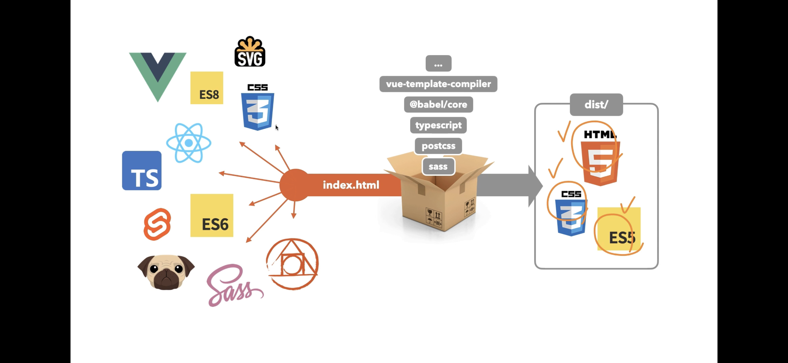

# bundler

## 필요성 및 등장배경

- web application의 규모가 커진 지금 다음의 문제 발생
  - 중복된 이름의 파일, 리소스, 함수명, 변수명들로 인한 에러
  - 유지보수를 위한 파일 분리(모듈화)는 클라이언트 브라우저에서 해당 파일들을 각각 요청하고, 파싱해 조합하는 과정 중 네트워크 병목현상 발생 / 그렇다고 여러 파일에 중복 코드들이 직접 들어가면, 유지보수 지옥
- 따라서 이와 같은 문제를 해결해주는 **bundler** 등장

## 역할

- 간단히 말하자면 여러 파일들을 하나로 묶어주는 역할
- 대표적으로 parcel, webpack, browserify 등 존재

## 특징

- nodeJS 환경하에 번들
  - 따라서 commonJS 환경의 require module.exports 등 사용(ems 도 설정시 사용 가능)

parcel 과 webpack 의 차이

도움 [출처_왜 bundler을 사용해야하는가](https://velog.io/@eastshine94/Bundler-%EC%99%9C-Bundler%EC%9D%84-%EC%82%AC%EC%9A%A9%ED%95%B4%EC%95%BC%ED%95%98%EB%8A%94%EA%B0%80) 