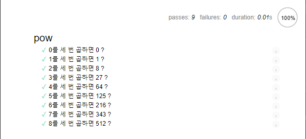
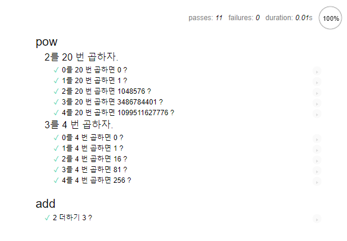
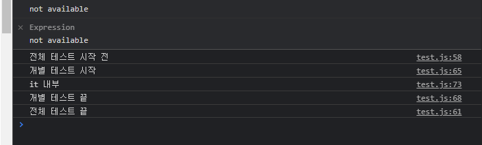

# mocha lib를 활용한 BDD (Behavior Driven Development) 테스트

- BDD는 테스트(test), 문서(document), 예시(example)을 한데 모아놓은 개념
- TDD(Test DD) 가 보다는 살짝 거시적인 개념


> mocha, chai lib.사용
>
> > **Mocha**: 테스트 핵심 프레임워크, `describe`, `it` 과 같은 테스팅 함수  제공
> >
> > **chai**: 다양한 assertion 제공해주는 lib.

### describe

```javascript
describe(제목, function() { ...})
```

- 구현하고자 하는 기능에 대한 명세

### it

```javascript
it(유즈케이스설명, function(){...}
```

- 첫 번재 인수에는 특정 유스케이스에 대한 설명(자연어)
- 두 번째 인수에는 유스케이스에 대한 테스트 함수

### assert

- 테스트 결과에 대한 확인하는 함수
- 다양한 assert의 확인 함수들은 직접 찾아보자
  - equal()
  - isTrue()
  - isNaN()
  - ...


## 예제 코드

index.html

```ja
<!DOCTYPE html>
<html>
  <head>
    <!-- 결과 출력에 사용되는 mocha css -->
    <link rel="stylesheet" href="https://cdnjs.cloudflare.com/ajax/libs/mocha/3.2.0/mocha.css" />
    <!-- Mocha: 핵심 테스트 프레임워크로, describe, it과 같은 테스팅 함수와 테스트 실행 관련 주요 함수를 제공-->
    <script src="https://cdnjs.cloudflare.com/ajax/libs/mocha/3.2.0/mocha.js"></script>
    <script>
      mocha.setup('bdd') // 기본 셋업
    </script>
    <!-- chai:  다양한 assertion을 제공해 주는 라이브러리 -->
    <script src="https://cdnjs.cloudflare.com/ajax/libs/chai/3.5.0/chai.js"></script>
    <script>
      // chai의 다양한 기능 중, assert를 전역에 선언
      let assert = chai.assert
    </script>
  </head>

  <body>
    <!-- 테스트 결과를 id가 "mocha"인 요소에 출력-->
    <div id="mocha"></div>

    <script>
      // 실제 테스트할 함수
      function pow(x, n) {
        let result = 1
        for (let index = 0; index < n; index++) {
          result *= x
        }
        return result
      }
    </script>

    <!-- 테스트(describe, it...)가 있는 스크립트 -->
    <script src="./test/test.js"></script>

    <!-- 테스트를 실행 -->
    <script>
      mocha.run()
    </script>
  </body>
</html>

```

test/test.js

```javascript
describe('pow', function() {
    it('2의 3제곱, 8', function(){
        assert.equal(pow(2,3), 8);
    })
})
```


## loop문으로 it 만들기

```javascript
// ! loop문으로 test code 만들기
describe('pow', () => {
  // 테스트 코드 maker
  const makeTest = (x) => {
    let expected = x * x * x
    it(`${x}를 세 번 곱하면 ${expected} ?`, () => {
      assert.equal(pow(x, 3), expected)
    })
  }

  for (let i = 0; i < 9; i++) {
    makeTest(i)
  }
})
```

아래와 같이 출력



##  중첩 describe

- 그룹해서 표현하기 좋다. describe로  describe를 묶기

```javascript
// ! 중첩 describe
describe('pow', () => {
  const makeDescribe = (x, n) => {
    describe(`${x}를 ${n} 번 곱하자.`, () => {
      // 테스트 코드 maker
      const makeTest = (x) => {
        let expected = 1

        for (let i = 0; i < n; i++) {
          expected *= x
        }
        it(`${x}를 ${n} 번 곱하면 ${expected} ?`, () => {
          assert.equal(pow(x, n), expected)
        })
      }

      for (let i = 0; i < 5; i++) {
        makeTest(i)
      }
    })
  }
```



## before / after  &  beforeEach / afterEach

대체로 초기화 용도로 사용된다.

카운터 변수에 0을 넣는 등

- `before`: **전체** 테스트가 실행되기 전에 실행
- `after`: **전체** 테스트가 실행된 후에 실행

- `beforeEach`: 매 `it`이 실행되기 전에 실행
- `afterEach`: 매 `it`이 실행된 후에 실행

```javascript
describe('add', () => {
  before(() => {    console.log('전체 테스트 시작 전')  })
  after(() => {    console.log('전체 테스트 끝')  })

  beforeEach(() => {    console.log('개별 테스트 시작')  })
  afterEach(() => {    console.log('개별 테스트 끝')  })

  it('2 더하기 3 ?', () => {
    assert.equal(add(2, 3), 5)
    console.log('it 내부')
  })
})
```




[[참고] modern js](https://ko.javascript.info/testing-mocha)

