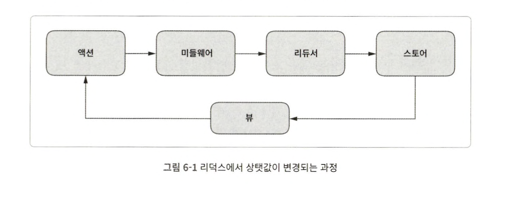

# 6장. 리덕스로 상태 관리하기

### 리덕스 사용 이유 - 데이터 접근, 관리 측면

1. 컴포넌트 코드로부터 상태 관리 코드 분리
2. SSR시 데이터 전달 간편
3. 로컬 스토리지에 데이터를 저장하고 불러오는 코드를 쉽게 작성 가능
4. 같은 상탯값을 다수의 컴포넌트에서 필요로 할 때 유용
5. 부모 컴포넌트에서 깊은 곳에 있는 자식 컴포넌트에 상탯값을 전달할 때 유용
6. 알림창과 같은 전역 컴포넌트의 상탯값을 관리할 때 유용
7. 페이지가 전환되어도 데이터는 살아 있어야 할 때 유용

## 6.1 리덕스 사용 시 따라야할 세 가지 원칙

1. 전체 상탯값을 **하나의 객체**에 저장

2. 상탯값은 **불변 객체**

   - 상탯값은 오직 액션 객체에 의해서만 변경

     ```js
     // 1. action 객체
     const incrementAction = {
       type: 'INCREMENT', 	// type 속성값으로 식별
       amount: 123, 				// type을 제외한 나머지는 상탯값을 수정하기 위해 사용되는 정보
     };
     
     const conditionalIncrementAction = {
       type: 'CONDITIONAL_INCREMENT',
       amount: 2,
       gt: 10,
       lt: 100,
     };
     
     // 2. action 객체와 함께 dispatch 메소드 호출하면 상탯값 변경
     store.dispatch(incrementAction);
     store.dispatch(conditionalIncrementAction);
     ```

3. 상탯값은 **순수 함수**에 의해서만 변경되어야 한다.

   - 순수 함수: 부수효과 발생 X / 같은 인수에 대해 항상 같은 반환값 => test 코드 작성에도 유리

   - 리덕스의 상탯값 변경 함수: reducer
     - reducer의 구조:  `(state, action) => nextState`

## 6.2 리덕스의 주요 개념 이해하기



c.f. vuex의 경우 상탯값 흐름도: **View** --(dispatch)--> **Action** --(commit)--> **Mutation** --> **State**(store)

### 6.2.1 액션

: type 프로퍼티를 식별자로 갖는 JS 객체

 store.dispatch() 메소드의 매개변수로 사용된다.

- type 프로퍼티는 식별성을 갖기 때문에 unique해야 한다.

  ```js
  store.dispatch({ type: 'todo/ADD', title: '영화 보기', priority: 'high' }); // 접두사 사용으로 식별성 up
  store.dispatch({ type: 'todo/REMOVE', id: '00001' });
  store.dispatch({ type: 'todo/REMOVE_ALL' });
  ```

- dispatch 메소드의 매개변수로 직접 action 객체를 넘기지 않고, 생성자 함수 사용

  ```js
  function addTodo( { title, priority } ) { // action을 반환하는 생성자 함수
    return { type: 'todo/ADD', title, priority }
  }
  
  store.dispatch(addTodo({ title: '영화보기', priority: 'high' })); // dispatch 호출
  ```

- action의 type은 상수로 관리 - dispatch 메소드로 이후에 호출되는 reducer에서도 사용되기 때문

  ```js
  export const ADD = 'todo/ADD';		// module system 으로 외부로 노출
  export const REMOVE = 'todo/REMOVE';
  export const REMOVE_ALL = 'todo/REMOVE_ALL';
  
  function addTodo( { title, priority } ) { // action을 반환하는 생성자 함수
    return { type: ADD, title, priority }
  }
  
  store.dispatch(addTodo({ title: '영화보기', priority: 'high' })); // dispatch 호출
  ```

- type 프로퍼티 외에도 원하는 프로퍼티를 넣을 수 있다.

### 6.2.2 미들웨어

: reducer가 action을 처리하기 전에 실행되는 함수

e.g. 디버깅 목적 - 상탯값 변경 시 로그 출력 / reducer에서 발생한 예외를 서버로 전송하는 등

- 미들웨어의 기본 구조

  ```js
  const myMiddleware = store => next => action => next(action);
  ```

  - 3개 함수의 콜백 구조
  - 콜백 가장 내부에서 `next(action);` 이 호출되면서 reducer 호출

- 미들웨어 설정 방법

  ```js
  import { createStore, applyMiddleware } from 'redux';
  
  const middleware1 = store => next => action => {
    console.log('middleware1 start');
    
    const result = next(action);	 // middleware2 호출
    
    console.log('middleware1 end');
    return result;
  };
  
  const middleware2 = store => next => action => {
    console.log('middleware2 start');
    
    const result = next(action);	 // 바깥 함수가 갖고 있는 store.dispatch 호출
    
    console.log('middleware2 end');
    return result;
  };
  
  const myReducer = (state, action) => {
    console.log('myReducer');
    return state;
  };
  
  const store = createStore(myReducer, applyMiddleware(middleware1, middleware2)); // store 생성
  store.dispatch({ type: 'someAction' });l 		// dispatch() 호출
  ```

  ```te
  // middleware1 start
  // middleware2 start
  // myReducer
  // middleware1 end
  // middleware2 end
  ```

- 미들웨어 활용의 예

  - 디버깅 - 상탯값 로그 출력

    ```js
    const printLog = store => next => action => {
      console.log(`prev state = ${store.getState()}`);
      const result = next(action);
      console.log(`next state = ${store.getState()}`);
    };
    ```

  - 에러 정보를 서버로 전송해주는 미들웨어

    ```js
    const reportcrash = store => next => action => {
      try {
      	const result = next(action);  
      } catch (err) {
        // 서버로 예외 정보 전송
      }
    };
    ```

  - 실행을 연기할 수 있는 미들웨어

    ```js
    const printLog = store => next => action => {
    	const delay = action.meta && action.meta.delay;
      if (!delay) {
        return next(action);
      }
      const timeoutId = setTimeout(() => next(action), delay); // delay 만큼 연기
      
      // setTimeout을 취소할 수 있는 함수를 리턴
      return function cancel() {
        clearTimeout(timeoutId);
      }
    }
    ```

    호출

    ```js
    const cancel = store.dispatch({
      type: 'SomeAction',
      meta: { delay: 1000 },
    });
    
    cancel(); // 호출하지 않으면 지연된 시간 후에 reducer 호출
    ```

  - 특정 액션일 때, 로컬 스토리지에 값을 저장하는 미들웨어

    ```js
    const saceToLocalStorage = store => next => action => {
      if(action.type === 'SET_NAME') {
        localStorage.setItem('name', action.name);
      }
      return next(action);
    }
    ```

    - `SET_NAME` 액션이 발생할 때마다 로컬 스토리지에 값 저장

### 6.2.3 리듀서

: action이 발생했을 때 새로운 상탯값을 만드는 함수

- reducer의 구조

  ```js
  (state, action) => nextState
  ```

- reducer 예시

  ```js
  function reducer( state = INITIAL_STATE, action) {
    switch (action.type) {
      case REMOVE_ALL:
        return {
          ...state,
          todos: [],
        };			// 새로운 state 반환 -> 불변객체이기 때문에
      case REMOVE:
        return {
          ...state,
          todos: state.todos.filter(todo => todo.id !== action.id),
        };
      default:
        return state;
    }
  }
  
  const INITIAL_STATE = { todos: [] };
  ```

  - action의 type 프로퍼티에 따라 새로운 state 객체를 반환한다.
  - 새로운 state를 반환해야 하기 때문에, 전개 연산자 사용

- 중첩된 객체 내부의 데이터 수정하기

  ```js
  function reducer(state = INITIAL_STATE, action) {
    switch (action.type) {
      case ADD:
        return {
          ...state,
          todos: [
            ...state.todos,
            { 
              id:getNewId(), 
              title: action.title, 
              priority: action.priority 
            },
          ],
        }
      default:
        return state;
    }
  }
  ```

  state 를 반환하기 위해 전개연산자를 두 번이나 사용하고 있다. => 가독성이 떨어짐

  이를 해결하기 위해 JS 의 불변 객체 관리 목적의 패키지 존재 => 그 중 **immer** 패키지 사용


- immer 패키지 사용하기

  - immer를 사용해 불변 객체 관리하기 예제

    ```js
    import produce from 'immer';
    
    const person = { name: 'mike', age: 22 };
    const newPerson = produce(person, draft => {
      draft.age = 32;
    });
    ```

    - produce 함수
      - 첫 번째 매개변수는 변경하고자 하는 객체
      - 두 번째 매개변수는 첫 번째 매개변수로 입력된 객체를 수정하는 함수
      - 첫 번째 매개변수로 받은 객체를 수정하지 않으며, 새로운 객체를 반환

- immer 패키지를 사용해 reducer 리팩토링

  ```js
  import produce from 'immer';
  // ...
  function reducer(state = INITIAL_STATE, action) {
    return produce(state, draft => {  // switch 문 전체를 produce로 감싸 return
      switch (action.type) {
        case ADD:
  				draft.todos.push(action.todo); // draft 매개변수 사용
          break;
        case REMOVE_ALL:
          draft.todos = [];
          break;
        case REMOVE:
          	draft.todos = draft.todos.filter(todo => todo.id !== action.id);
          	break;
        default:
          break;
      }  
    });
  }
  ```

- 🚨 reducer 사용 시 주의할 점 :

  1. 데이터 참조

     - 리덕스의 상탯값은 불변 객체 => 언제든지 객체의 참조값이 변경될 수 있음

     - 따라서 객체를 참조할 때에는 객체의 참조값이 아닌 고유한 ID 값(primitive type)을 사용

  2. 순수 함수

     - reducer는 순수함수로 작성해야 함
     - Math.random() 사용할 수 없다.
     - API 호출은 부수효과(side effect)이기 때문에 사용 X -> 생성자 함수 또는 미들웨어에서 호출해야 함

- createReducer 함수로 reducer 생성하기

  redux 환경에서는 직접 reducer를 작성하지 않고, createReducer 라는 함수로 생성

  - createReducer 함수 생성

    ```js
    import produce from 'immer';
    
    function createReducer(initialState, handlerMap) {
      return function(state = initialState, action) { 	// reducer 리턴
        return produce(state, draft => {								// immer.produce 사용
          const handler = handlerMap[action.type];
          if (handler) {
            handler(draft, action);											// 등록된 액션 처리함수가 있다면 호출
          }
        })
      }
    }
    ```

    

  - createReducer 사용하기

    ```js
    const reducer = createReducer(INITIAL_STATE, {
      [ADD]: (state, action) => state.todos.push(action.todo),
      [REMOVE_ALL]: state => (state.todos = []),
      [REMOVE]: (state, action) => (state.todos.filter(todo => todo.id !== action.id)),
    })
    ```

    - 첫 번째 매개변수로 초기 상탯값
    - 두 번째 매개변수로 액션 처리 함수를 담고 있는 객체

## 6.2.4 스토어

- store는 리덕스의 상탯값을 가지는 객체

- action의 발생은 **store**의 **dispatch** 메소드로 시작

  1. store.**dispatch**(action) 호출
  2. middleware 함수 실행
  3. reducer 실행 -> 새로운 상탯값으로 변경
  4. 사전에 등록된 모든 이벤트 처리 함수에게 action 처리 끝났다고 알림

  

- store 의 subscribe 메소드를 사용해 상탯값 변경 여부 확인

  ```js
  const INITIAL_STATE = { value: 0 };
  const reducer = createReducer(INITAIL_STATE, {
    INCREMENT: state => (state.value += 1),
  });
  
  const store = createStore(reducer);
  
  let prevState;
  store.subscribe(() => {					// store.subscribe() : 상탯값 변경시 호출
    const state = store.getState();
    if(state === prevState)	// 불변 객체이기 때문에 단순비교 가능
      console.log('상탯값 같음');
    else 
      console.log('상탯값 변경됨');
    
    prevState = state;
  });
  
  store.dispatch({ type: 'INCREMENT' }); 
  store.dispatch({ type: 'OTHER_ACTION' });
  store.dispatch({ type: 'INCREMENT' }); 	// '상탯값 같음' 출력
  
  ```

  

## 6.3 데이터 종류별로 상탯값 나누기

프로그램 안에서 사용되는 데이터의 양이 많아지면, 데이터를 체계적으로 구조화할 필요가 생김

큰 기능별로 폴더를 만들어 코드 관리

리덕스 코드도 각 기능 폴더 하위에 작성해서 관리하는 게 좋음

- 리덕스에서 제공하는 combineReducer 함수를 사용하면 reducer 함수를 여러 개로 분리할 수 있음
- reducer 가 여러 개로 작성되다 보면 공통 로직이 생길 수 있다.

- 덕스 패턴
  - 연관된 action type, action 생성자 함수, reducer 함수를 하나의 파일로 작성
  - reducer 함수는 `export default` 키워드로 내보낸다.
  - action 생성자 함수는 `export` 키워드로 내보낸다.
  - 액션 타입은 접두사와 액션 이름을 조합해서 만든다.

## 6.4 react-redux 패키지 사용

: react 컴포넌트에서 redux에 저장된 store.state의 변화를 감지해 쉽게 핸들링할 수 있는 패키지

- **Provider** 컴포넌트 사용

  - Provider 컴포넌트 하위에 있는 컴포넌트는 redux의 상탯값이 변경되면 자동으로 컴포넌트 함수가 호출되도록 할 수 있다.

  - store 객체를 Provider 컴포넌트의 속성값으로 넣는다

    - store.subscribe 메소드를 호출해 action 처리가 끝날 때 알림을 받고, context API를 사용해 redux의 상탯값을 하위 컴포넌트로 전달

    ```jsx
    import React from 'react';
    import ReactDOM from 'react-dom';
    import TimelineMain from './timeline/container/TimelineMain';
    import FriendMain from './friend/container/FriendMain';
    
    import store from './common/store';
    import { Provider } from 'react-redux';
    
    ReactDOM.render(
      <Provider store={store}>
        <div>
          <FriendMain />
          <TimelineMain />
        </div>
      </Provider>,
      document.getElementById('root'),
    );
    ```

    

- useSelector, useDispatch
  - **useSelector** 훅
    - 선택자 함수를 인자로 받는다.
    - 선택자 함수의 반환값이 훅의 반환값
    - redux의 상탯값이 변경되면, 이전 반환값과 새로운 반환값을 비교해, 다른 경우에만 rendering

## 6.5 reselect 패키지로 선택자 함수 만들기

: reselect 패키지로 선택자 함수 작성

- reselect 패키지는 메모이제이션 기능 존재
  - 연산에 사용되는 데이터가 변경된 경우에만 연산 수행, 변경되지 않았다면, 이전 결괏값 재사용

```js
import { createSelector } from 'reselect';

// state의 데이터 getter
const getFriends = state => state.friend.friends;
const getAgeLimit = state => state.friend.ageLimit;
const getShowLimit = state => state.friend.showLimit;

export const getFriendsWithAgeLimit = createSelector(
  [getFriends, getAgeLimit],
  (friends, ageLimit) => friends.filter(f => f.age <= ageLimit), // 배열의 함수 반환값을 파라미터로 받아 처리
);

export const getFriendsWithAgeShowLimit = createSelector(
  [getFriendsWithAgeLimit, getShowLimit],
  (getFriendsWithAgeLimit, showLimit) =>
    getFriendsWithAgeLimit.slice(0, showLimit),
);

```


```js
// 사용 컴포넌트
// ...
// 정의한 getter import
import {
  getAgeLimit,
  getShowLimit,
  getFriendsWithAgeLimit,
  getFriendsWithAgeShowLimit,
} from '../state/selector';

// ! react-redux 패키지 사용 (useSelector, useDispatch)
// ! reselect 사용
const FriendMain = () => {
  const [ageLimit, showLimit, friendsWithAgeLimit, friendsWithAgeShowLimit] =
    // 01. reselect 로 인해 useSelector 의 콜백함수 간결화
    useSelector(
      state => [
        getAgeLimit(state),
        getShowLimit(state),
        getFriendsWithAgeLimit(state),
        getFriendsWithAgeShowLimit(state),
      ],
      shallowEqual,
    );
  
  	// 02. 다음과 같이 사용 가능
  const ageLimit = useSelector(getAgeLimit);
  const showLimit = useSelector(getShowLimit);
  const friendsWithAgeLimit = useSelector(getFriendsWithAgeLimit);
  const friendsWithAgeShowLimit = useSelector(getFriendsWithAgeShowLimit);
  // ...
}
```

## 6.6 리덕스 사가를 이용한 비동기 액션 처리

리덕스에서 비동기 액션을 처리하기 위해 많이 사용되는 패키지 목록

- redux-thunk
- redux-observale
- redux-saga

redux-saga

```js
// redux-saga 에서 부수효과를 발생시킬 때 사용하는 함수
import { all, call, put, take, fork } from 'redux-saga/effects';
import { actions, types } from '.';
import { callApiLike } from '../../common/api';


/**
 * REQUEST_LIKE 액션을 처리하는 제네레이터 함수 - 사가 함수
 * 제네레이터 객체(next, done 프로퍼티 보유) 반환
 * 사가 미들웨어에서 호출하며 로직 실행
 *
 * @param   {[type]}  action  [action description]
 *
 * @return  {[type]}          [return description]
 */
export function* fetchData(action) {
  while (true) {
    const { timeline } = yield take(types.REQUEST_LIKE); // take: 액션객체 가져온다
    yield put(actions.setLoading(true));  // put : 새로운 액션 발생 -> store.dispatch 호출
    yield put(actions.addLike(timeline.id, 1));
    yield call(callApiLike);              // 입력된 함수를 대신 호출(해당 함수가 Promise 객체를 반환하면 resolve 까지 기다림) 
    yield put(actions.setLoading(false));
  }
}

// 여러 개의 사가 함수를 모아놓은 함수
export default function* watcher() {
  yield all([fork(fetchData)]);
}

```

store.js

```js
import { createStore, combineReducers, applyMiddleware } from 'redux';
import timelineReducer from '../timeline/state';
import friendReducer from '../friend/state';

import createSagaMiddleware from '@redux-saga/core';
import timelineSaga from '../timeline/state/saga';

const reducer = combineReducers({
  timeline: timelineReducer,
  friend: friendReducer,
});

// saga middleware 생성
const sagaMiddleware = createSagaMiddleware();

// store 생성시 미들웨어 전달
const store = createStore(reducer, applyMiddleware(sagaMiddleware));

// store 객체를 원하는 곳에서 가져다 사용할 수 있다.
export default store;

sagaMiddleware.run(timelineSaga); // 사가 미들웨어 호출

```

