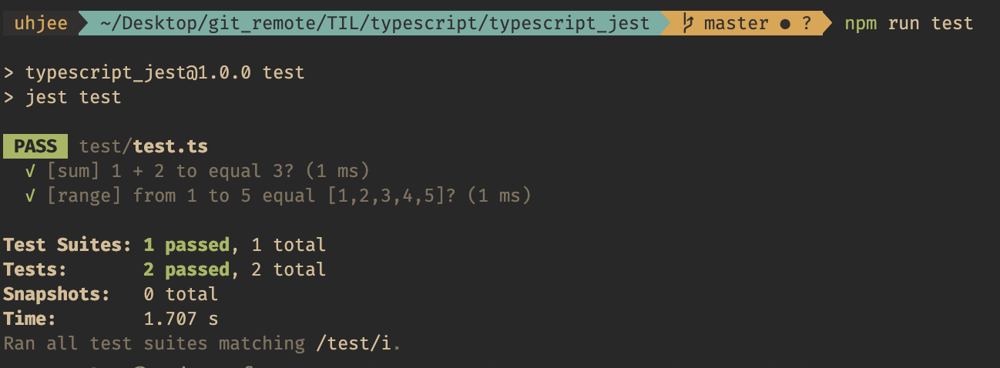

# jest 라이브러리 사용해보기

지난 번에 mocha lib.을 통해 간단한 테스트 코드를 작성해보았다.  
npm trends에서 test lib.들을 비교해보니, jest가 mocha 보다 많이 사용되고 있었다.  
 그 이유는 보다 간결한 테스트 코드를 작성할 수 있기 때문인 것 같았다.  
 그래서 마침 typescript 공부를 하며 테스트 코드 작성 연습도 할 겸, jest 공홈을 따라 간단히 테스트를 구성해보았다.

---

## 테스트 환경 구축

1. 다음의 package를 깔았다.

   ```powershell
   npm i -D typescript jest ts-jest @types/jest
   ```

   - ts-jest와 @types/jest 의 각 역할에 대해 다시 공부해봐야 한다. (@types/[package_name] 형태 공부)

1. tsc config 초기화
   ```powershell
   tsc --init
   ```
   - 초기 설정 사용
1. ts-jest config 초기화

   ```powershell
   ts-jest config:init
   ```

   - 초기 설정 그대 로 일단 사용.. 각종 option 공부 필요

1. `package.json` script 설정
   ```json
   ...
   "scripts": {
     // ./test/test.ts 사용
      "test": "jest test"
   },
   ...
   ```

---

## 테스트 코드 작성

- 테스트의 대상이 될 `sum` 함수와, `range` 함수를 구현해보았다.
- es6의 module system을 사용해 export 했다.

  ```ts
  // ./src/index.ts

  export const sum = (a: number, b: number): number => a + b;

  export const range = (from: number, to: number): number[] => (from < to ? [from, ...range(from + 1, to)] : []);
  ```

- 다음은 실제 테스트를 위한 코드 작성
- es6 module system import
- expect, toBe, toStrictEqual 등 docs를 보고 다양한 테스트를 만들고 검증하는 연습을 해야겠다.

  ```ts
  import { sum, range } from '../src/index';

  test('[sum] 1 + 2 to equal 3?', () => {
    // toBe() : primitive type을 비교할 때 사용
    expect(sum(1, 2)).toBe(3);
  });

  test('[range] from 1 to 5 equal [1,2,3,4,5]?', () => {
    // toStrictEqual() : 같은 타입, 같은 구조의 object를 비교할 때 사용
    expect(range(1, 5 + 1)).toStrictEqual([1, 2, 3, 4, 5]);
  });
  ```

## 테스트 실행

```powershell
  npm run test
```

## 실행 결과 콘솔



- 다양한 테스트 유형과 해당 메소드들을 공부해야겠다.
- 공부할 때에도, 실무에서도 test에 좀 더 익숙해져야겠다.
- typescript 공부를 하려다 jest 공부를 했다^^
